# pfsense-firewall-wazuh

# VirtualBox Network Setup
In VirtualBox, go to file and select on Host Network Manager and click on create which should create vboxnet0 with a IP of 192.168.56.1 and turn off DHCP. Then click on preferences and select network -> NAT Network and click on create. 
Name the NAT Network to lab-wan and assign it the ip of 10.10.0.0/24 and click ok.  

# pfsense
To download pfsense go to pfsense.org/download or click this link:  
https://pfsense.org/download/   
Then click on create a new VM with the type set to BSD and FreeBSD 64 bit.  
RAM set to 1024 MB with 8 gigs of disk space.   
Then for the adapters, set adapter 1 to lab-wan and 2 to vboxnet0.  
Then go the downloads folder and find the netgate download and type gunzip and the file to get it unzipped. After that boot into the VM as a iso and configure the settings like wlan, lan and more to get pfsense installed, then click on ok for it to reboot. After it gets done rebooting, go the storage side on VirtualBox and remove the pfsense installer and restart the VM. After a few minutes in the VM, this screen will appear:   
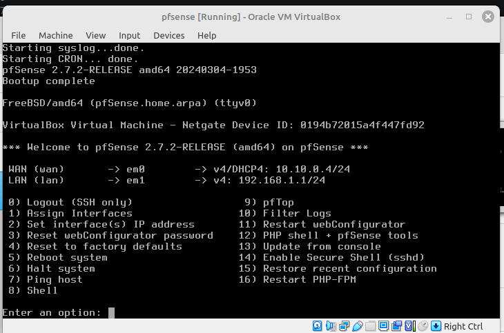  
This shows that it installed successfully.  
Then to change the IP of the LAN since it needs to end in a 2. Start by typing 2 and for the next option press 2:   
    
Then do n, ignore screenshot, for IPv4 DHCP and no to IPv6 and enter the new LAN IP as 192.168.56.2. After which this screen will pop up:   
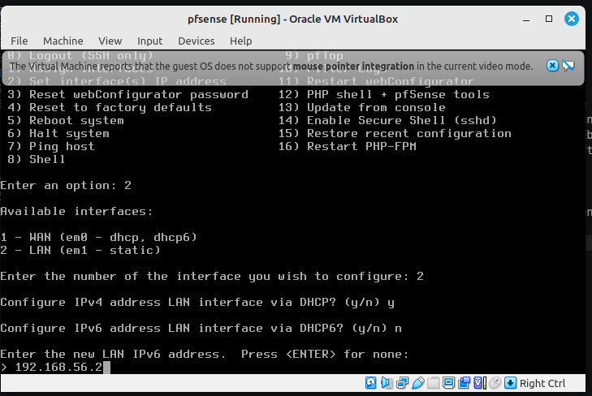    
Then for the LAN Subnet type 24 and for IPv6 on LAN put n or just press Enter. Then for IPv6 address LAN put n and for LAN IPv6 address press enter. Then type y for enabling DCHP on LAN and set the range like so:    
    
Pressing enter you will see this:   
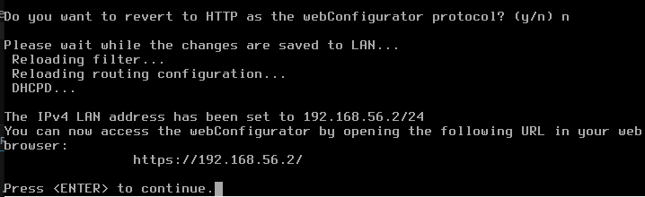    
Then go type the new address of 192.168.56.2 in a browser:  
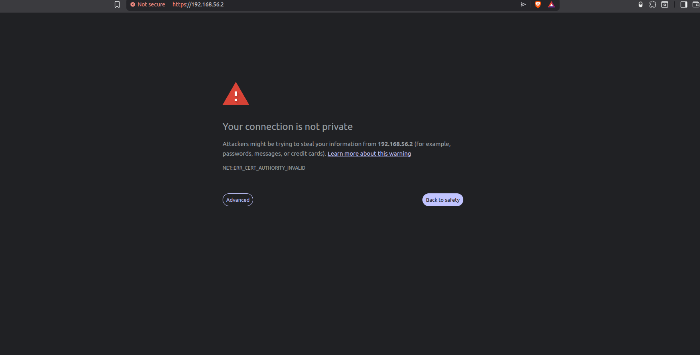    
Click advanced and proceed. 
Then you will see the login screen and enter in the admin creds and get into pfsense:   
    
Then click next and set up the general information for pfsense, for hostname put something like lab-firewall, domain to lab.local, primary DNS to 1.1.1.1 and secondary to 8.8.8.8. Then hit next.  
For time server set to Central Time or Chicago and hit next.    
Then for WAN Interface section leave it as DHCP and scroll down to hit next.    
Then for LAN Interface section leave it as it and hit next. 
Then set the password and hit next. and for step 7 reload it. After a few seconds:  
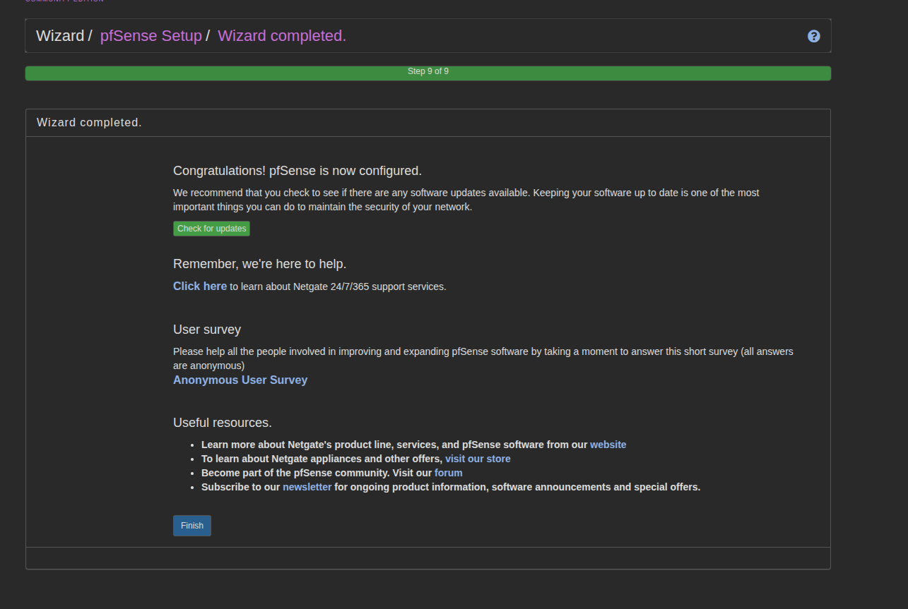    
It is finished and hit finish and be taken to the main page:    
    
Then to test connectivity go to Diagnostics -> Ping and for hostname type 1.1.1.1 and hit ping: 
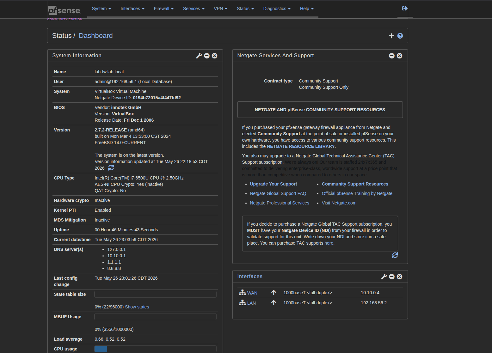    
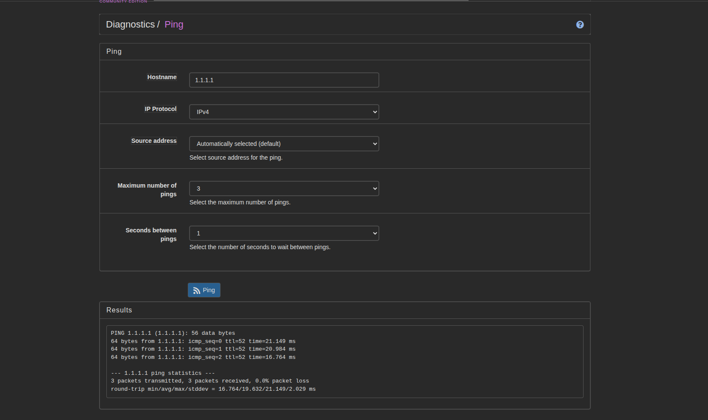   

Then its time to set up a few VLANs, which can be done in either VM or website: 
Website by going to Interfaces -> VLANs:    
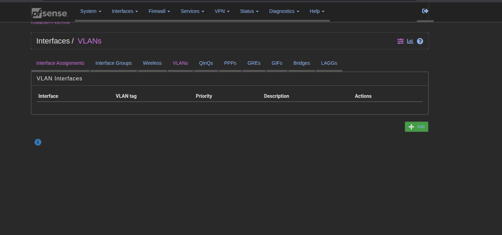
Or VM by pressing option 1:  
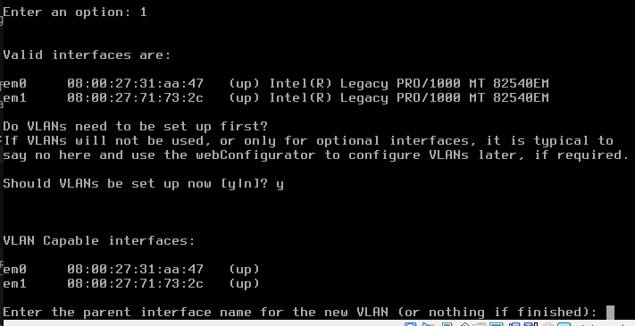   
In this instance, lets use the Webiste. Click on add and see this screen:   
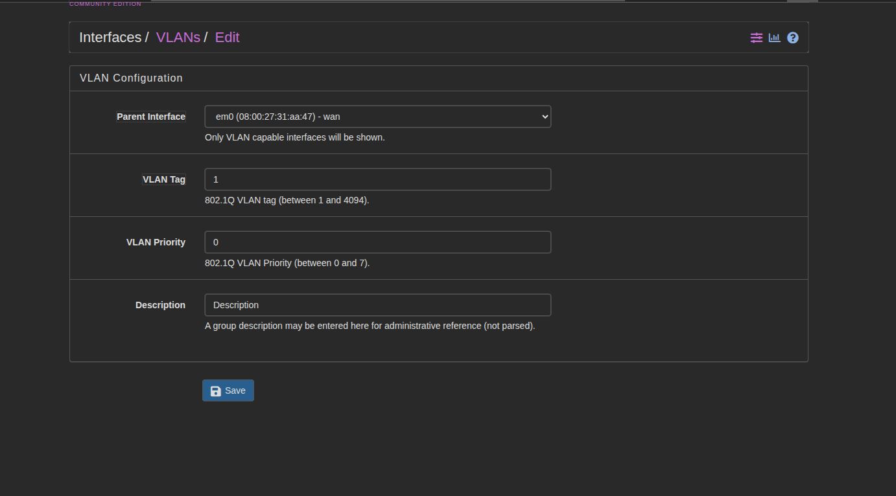   
Change the parent interface to LAN, change VLAN tag to 10, keep priority at 0 and set Description to MGMT for for the first VLAN and hit save.  
Then set up the other VMs like below:    
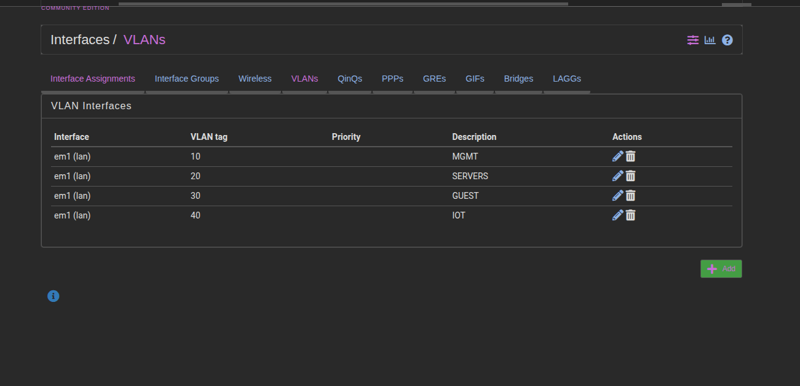   

Then lets move on the Firewall -> Aliases and see this screen:  
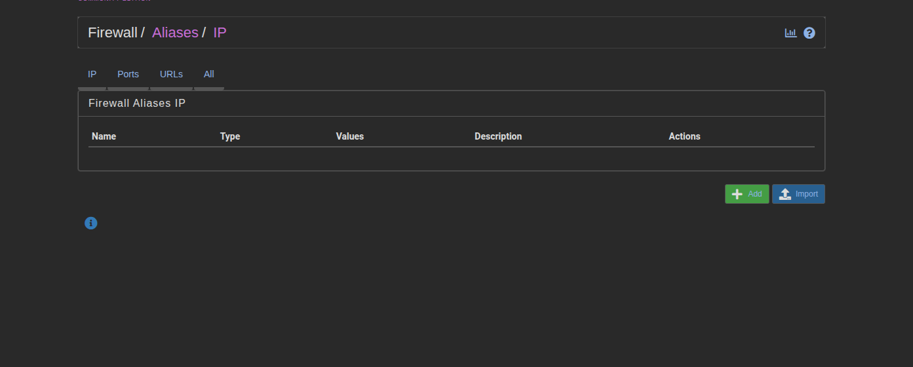

