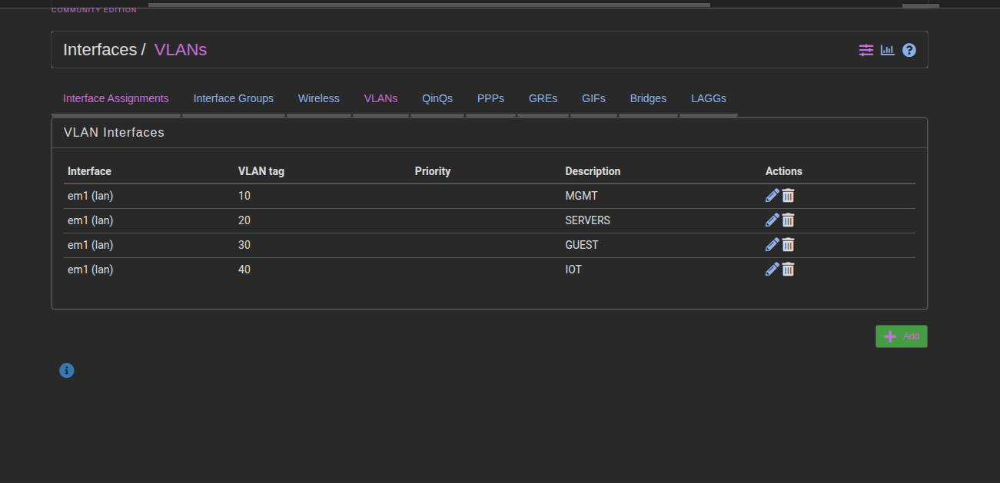
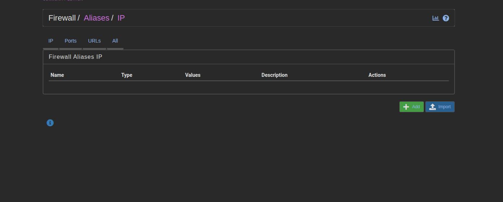

# pfsense-firewall-wazuh

# VirtualBox Network Setup
In VirtualBox, go to file and select on Host Network Manager and click on create which should create vboxnet0 with a IP of 192.168.56.1 and turn off DHCP. Then click on preferences and select network -> NAT Network and click on create. 
Name the NAT Network to lab-wan and assign it the ip of 10.10.0.0/24 and click ok.  

# pfsense
To download pfsense go to pfsense.org/download or click this link:  
https://pfsense.org/download/   
After downloading, right click on the file and extract it which will have the iso needed to create the pfSense VM:  
    
Then to go VirtualBox and click on create a new VM with the type set to BSD and FreeBSD 64 bit.  
RAM set to 1024 MB with 8 gigs of disk space.   
Then for the adapters, set adapter 1 to lab-wan and 2 to vboxnet0.  
Then boot up the VM and see the terms screen:   
    
Accept it and continue and see the Welcome to pfSense screen and hit continue to see WAN interface set up:  
    
The first option will be the NAT that was set up lan-wan and hit ok and continue/proceed with the installation and circle back to this: 
    
The LAN will be the host only chosen adapter, hit ok and continue/proceed with the installation and confirm the settings and reach this screen: 
    
Choose the Install CE option and wait a few seconds before getting here:    
  
Keep the default and hit next and get to this:  
  
Then hit OK and it will ask if you want to destory the disk, hit yes and wait a few seconds and for the software version, choose the stable version:    
  
Then hit ok and the install screen will pop up for downloading and updating so wait a few minutes then this screen will appear: 
  
Then hit OK and get to the do you want to reboot screen, then go to devices -> optical drives and click on the option to remove the iso from virtual drive and click the option of force umount. Then shut down the VM and turn it back on again to get here:
    
This shows that it installed successfully.  
Then to change the IP of the LAN since it needs to end in a 2. Start by typing 2 and for the next option press 2:   
    
Then do n, ignore screenshot, for IPv4 DHCP and no to IPv6 and enter the new LAN IP as 192.168.56.2. After which this screen will pop up:   
     
Then for the LAN Subnet type 24 and for IPv6 on LAN put n or just press Enter. Then for IPv6 address LAN put n and for LAN IPv6 address press enter. Then type y for enabling DCHP on LAN and set the range like so:    
     
Pressing enter you will see this:   
     
Then go type the new address of 192.168.56.2 in a browser:  
     
Click advanced and proceed. 
Then you will see the login screen and enter in the admin creds and get into pfsense:   
     
Then click next and set up the general information for pfsense, for hostname put something like lab-firewall, domain to lab.local, primary DNS to 1.1.1.1 and secondary to 8.8.8.8. Then hit next.  
For time server set to Central Time or Chicago and hit next.    
Then for WAN Interface section leave it as DHCP and scroll down to hit next.    
Then for LAN Interface section leave it as it and hit next. 
Then set the password and hit next. and for step 7 reload it. After a few seconds:  
     
It is finished and hit finish and be taken to the main page:    
     
Then to test connectivity go to Diagnostics -> Ping and for hostname type 1.1.1.1 and hit ping: 
     
   

Then its time to set up a few VLANs, which can be done in either VM or website: 
Website by going to Interfaces -> VLANs:    

Or VM by pressing option 1:  
   
In this instance, lets use the Webiste. Click on add and see this screen:   
   
Change the parent interface to LAN, change VLAN tag to 10, keep priority at 0 and set Description to MGMT for for the first VLAN and hit save.  
Then set up the other VMs like below:    
   

Then lets move on the Firewall -> Aliases and see this screen:  

